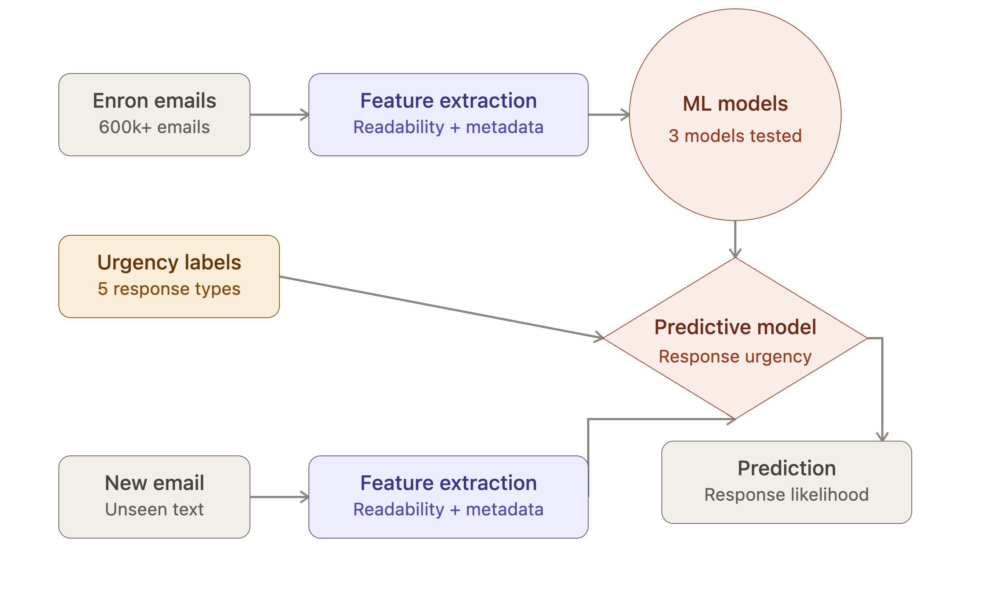
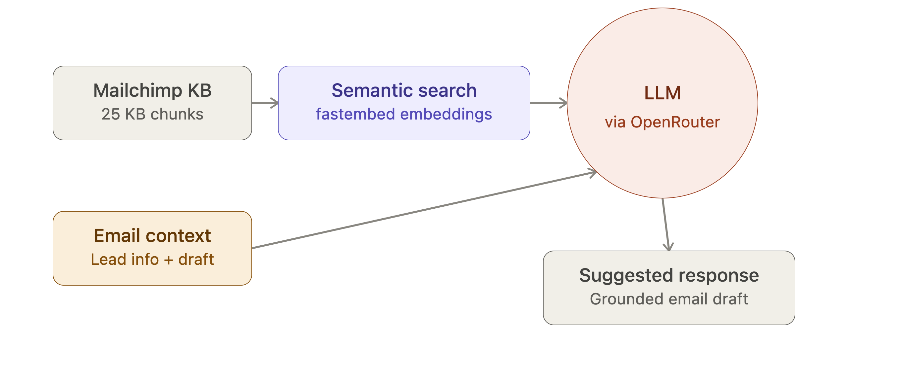
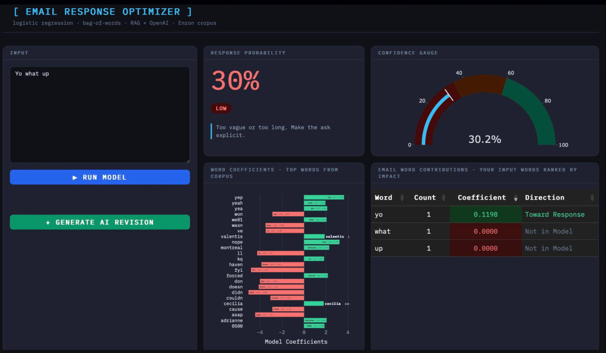
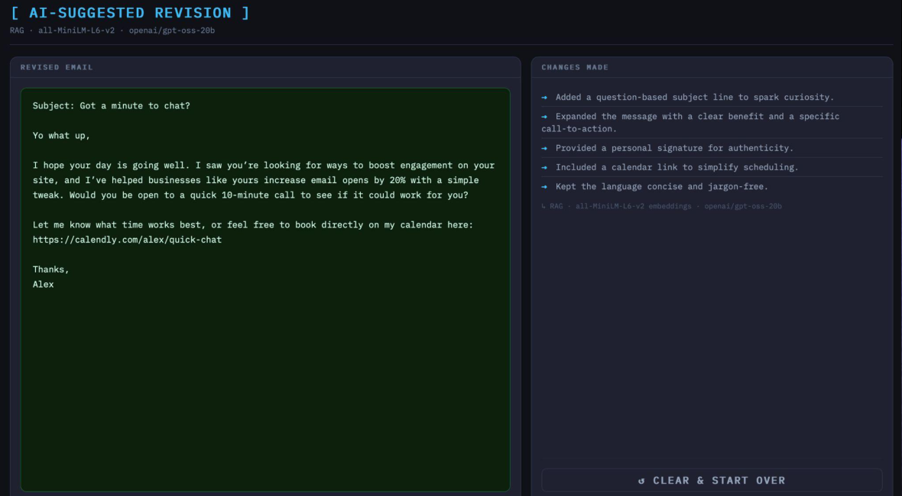
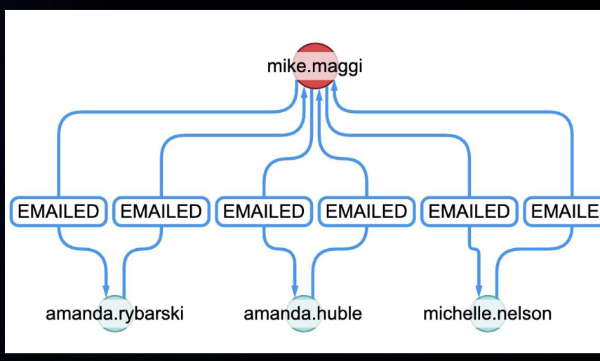
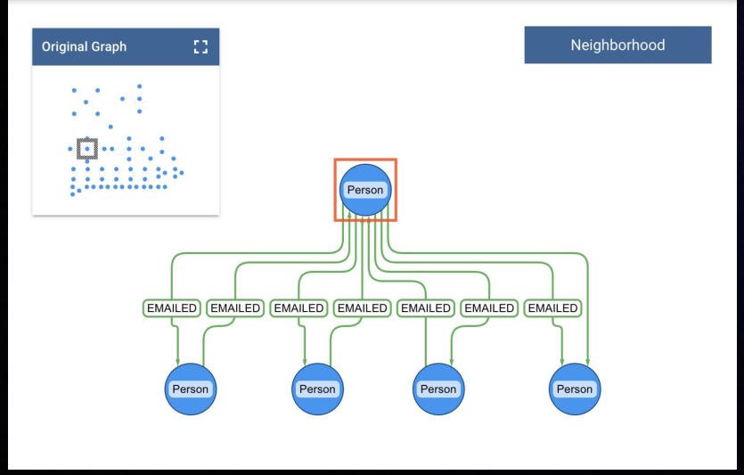

# NLP Email Optimization Engine

Predicts whether an email will get a fast reply — and rewrites it so it will.

Trained on 600k+ real corporate emails from the Enron corpus, the model reads an email and scores its likelihood of a response within 3 hours using nothing but extracted text features: `char_count`, `exclamation_count`, `token_count`, `avg_word_length`, `stop_word_count`, `syllable_count`, `has_question`, `email_send`. A RAG layer then pulls from a Mailchimp best-practices knowledge base and uses an LLM to rewrite low-scoring emails, explaining exactly what it changed and why.

**Live app:** [grantalan.shinyapps.io/email-response-optimizer](https://grantalan.shinyapps.io/email-response-optimizer/)

## How it works

**Prediction pipeline** — engineered features (readability + metadata) from 600k+ Enron emails train a logistic regression classifier that scores response likelihood on unseen text.

**RAG rewrite pipeline** — the email is embedded and matched against a Mailchimp best-practices knowledge base via semantic search; the retrieved guidance, the email, and its prediction score are passed to an LLM (via OpenRouter) to produce a grounded rewrite.

## The app

Paste in an email and get a live response-probability score, a confidence gauge, and a breakdown of which words in your email are pulling the score up or down.

Hit **Generate AI Revision** to get a rewritten draft plus a plain-English list of what changed and why.

## Neo4j Network Analysis

Text features only tell part of the story — who you're emailing matters too. A Neo4j graph of the Enron corpus surfaces who's fastest to respond and who's most central in the org's email traffic.

 

**To run it yourself:** open `notebooks/Neo4j_network_diagram.ipynb` in Jupyter and run it against your own Neo4j instance to generate the graph data. To visualize it, upload the exported graph to [yWorks yEd Live](https://www.yworks.com/yed-live/) and explore the network interactively in the browser.

## Tech stack

- **Modeling:** Python, scikit-learn (logistic regression), pandas, numpy
- **RAG / LLM:** fastembed (`all-MiniLM-L6-v2`), OpenRouter (`openai/gpt-oss-20b`)
- **App:** R Shiny, bslib, plotly, reticulate
- **Graph analysis:** Neo4j
- **Deployment:** shinyapps.io

## Data Source & Citation

This project uses data derived from the **Enron Email Reply Dataset**, 
available on Kaggle:

- Dataset: [Enron Email Reply Dataset](https://www.kaggle.com/datasets/oanannv/enron-email-reply-dataset)
- Author: oanannv (Kaggle)
- Accessed: June 2026

This dataset is itself derived from the original **Enron Email Dataset**, 
released publicly by the Federal Energy Regulatory Commission (FERC) 
during its investigation of Enron, and later made available for research 
purposes (notably by CALO/Carnegie Mellon University).

> Klimt, B., & Yang, Y. (2004). The Enron Corpus: A New Dataset for 
> Email Classification Research. *Machine Learning: ECML 2004*.

**Note:** This data is used here for educational/research purposes. 
The original emails contain real, sensitive personal communications 
from former Enron employees — please use responsibly and avoid 
republishing personally identifiable content beyond what's already 
in the public corpus.
